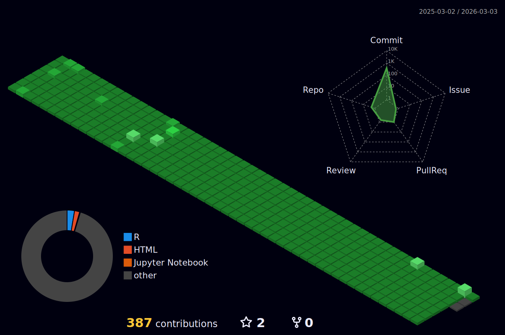

       
  

### Hello, World! 👋

- 👨‍💻 I’m currently working in **Marketing Research**
- 📊 I can **design surveys** and **analyze data**
- 💻 I can preprocess and analyze data using **R**
  - **R** ⭐⭐⭐☆☆
  - **Python** ⭐⭐☆☆☆
  - **MySQL** ⭐☆☆☆☆
- 🌏 I can use the packages of **tidyverse**
  - dplyr, tidyr, tibble, stringr, lubridate, purrr, ggplot...
- 📃 I can write document using **Quarto**, **R Markdown**, **Bookdown**
- 🏗️ I can develop **Shiny App** for data preprocessing
- ☺️ I'm someone who feels at ease when looking at data
- 🖥️ I'm currently working on a pet project to develop automation of dashboards and web reports that can be used in marketing

  

